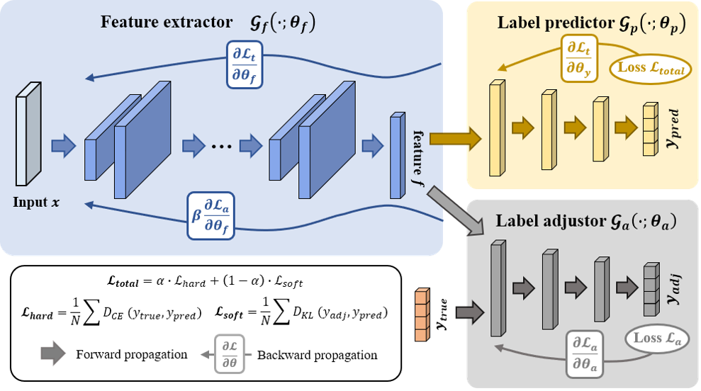

# Domain-Generalization-by-Dynamic-Label-Smoothing-Strategy-for-Biosignals-Classification
Code for the model in the paper Domain Generalization by Dynamic Label Smoothing Strategy for Biosignals Classification

# Datasets

>We evaluate the performance of our proposed dynamic label smoothing strategy on NinaPro DB1 datasets, which are open-access databases of Electromyography (EMG) recordings.

# Requirements

* Python 3.8
* Pytorch 1.11.0
* sklearn 0.24.0

# Function of file

* `Domain-Generalization-by-Dynamic-Label-Smoothing-Strategy-for-Biosignal-Classification/`
  * train model.
* `Domain-Generalization-by-Dynamic-Label-Smoothing-Strategy-for-Biosignal-Classification/`
  * Generate model.

# Usage
We've offered three models:  `Model1` , `Model2` and `Model3`
You need to use a tensor with shape: **[Batch_size, channel, length]** for all the three models.
